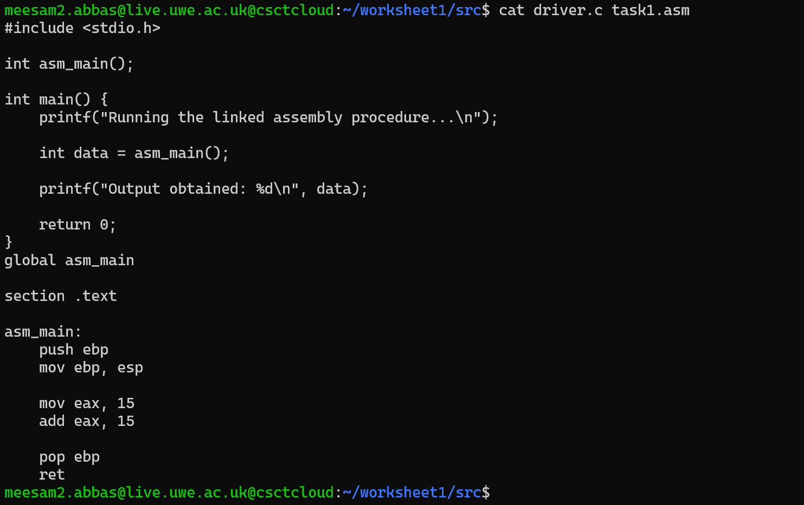
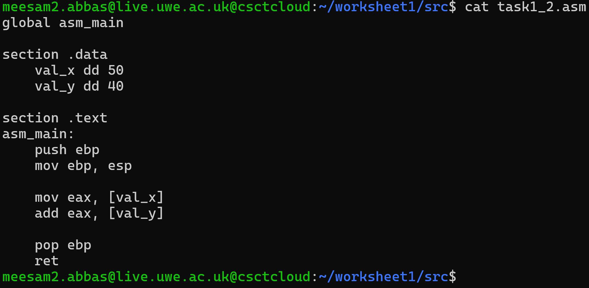
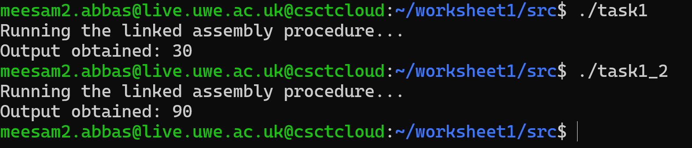
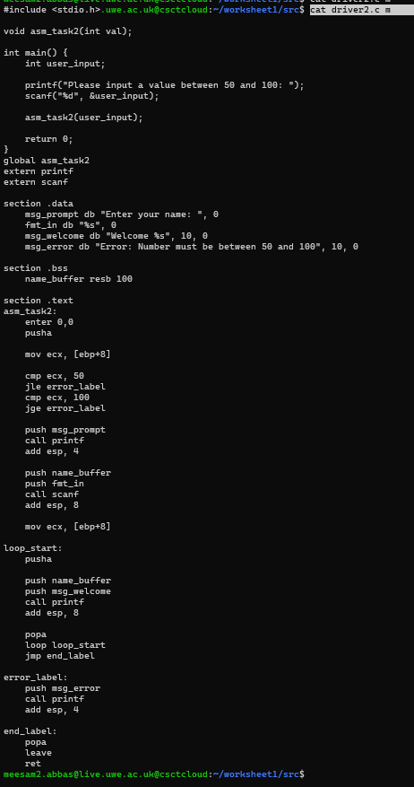
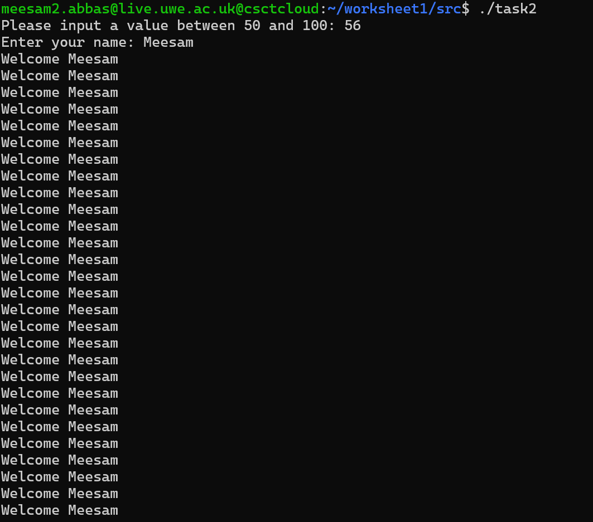
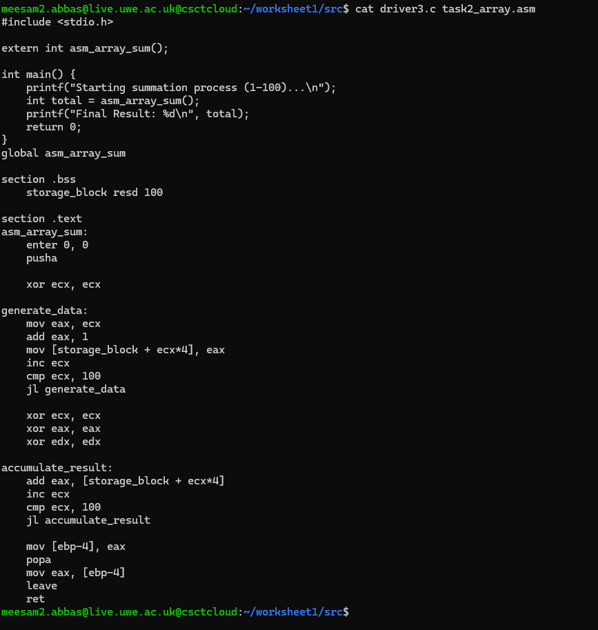
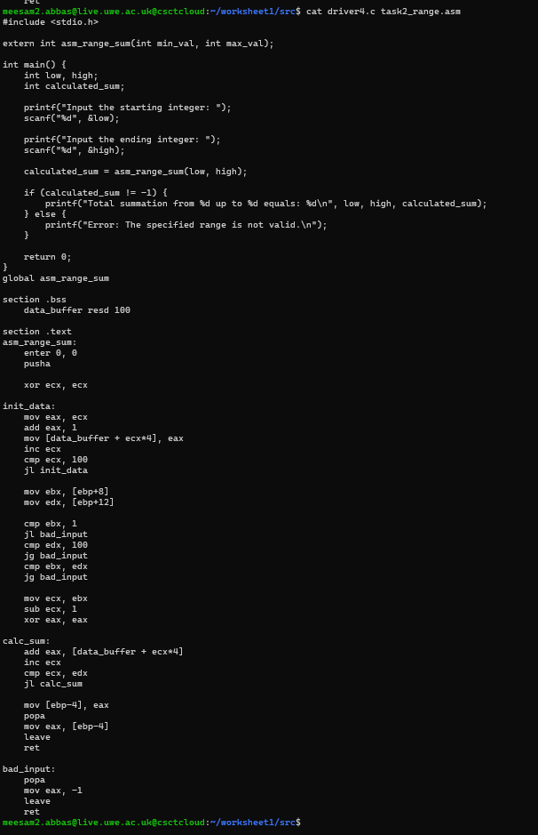
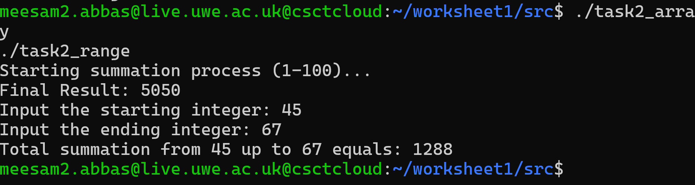
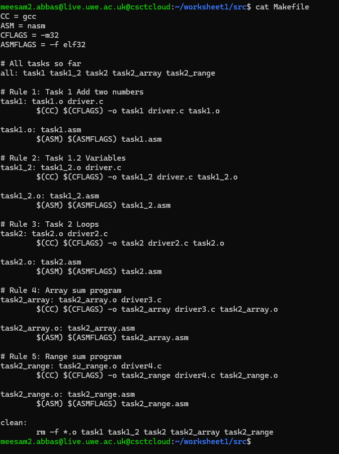
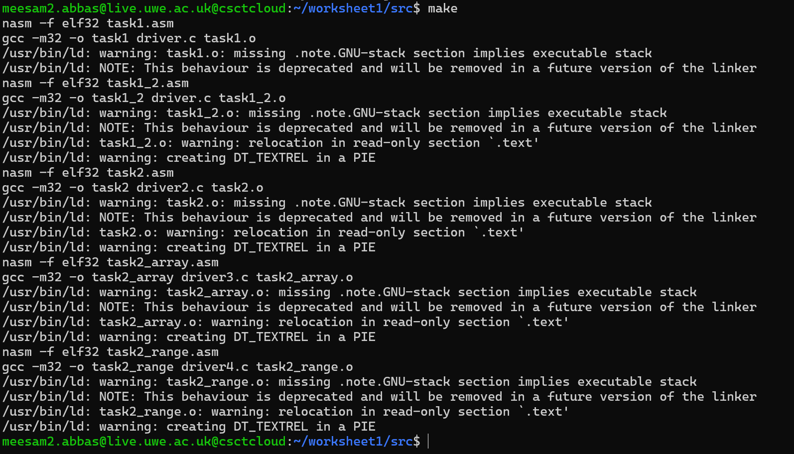

# Systems Programming: Worksheet 1 (Assembly & C Integration)

This project contains the solutions for Worksheet 1, focusing on the fundamentals of Operating Systems development. The primary objective was to bridge the gap between High-Level Languages (C) and Low-Level Assembly (NASM), while also implementing build automation tools.

## Directory Overview
Below is a snapshot of the source files, drivers, and scripts developed during this worksheet.


---

## Part 1: Linking C and Assembly

**Objective:**
The aim was to create a basic `asm_main` function in Assembly to perform arithmetic operations (adding 10 + 20) and return the integer result to a C driver. This established the foundational link between the two languages.

**Implementation Details:**
I wrote a C driver to act as the entry point, which calls the external Assembly function. The Assembly code handles the calculation and ensures the result is placed in the `EAX` register for the C program to read.

* **Task 1 Code (Basic):** `t1_code.png`
* **Task 1.2 Code (Variables):** `t1_2_code.png`




**Technical Takeaways:**
I learned that the `EAX` register is the standard convention for returning integer values to C functions. Additionally, I explored the `.data` section in Task 1.2 to use stored variables instead of immediate values, and I practiced stack management using `pusha` and `popa` to preserve register states.

**Execution Results:**


*(Output showing successful execution of Task 1 and Task 1.2)*

---

## Part 2: Control Structures (Loops)

**Objective:**
To implement logic flow in Assembly by creating a program that accepts user input (range 50-100) and prints a "Welcome" message that many times.

**Source Code:**



**Technical Takeaways:**
This task was crucial for understanding how `for` and `while` loops translate to machine code. I utilized `cmp` (compare) instructions alongside conditional jumps (`jl`, `jg`) to control the flow. I also implemented input sanitization to reject values outside the specified range.

**Program Output:**



---

## Part 2 Extension: Memory Addressing & Arrays

**Objective:**
This extension required manipulating memory directly:
1.  **Array Sum:** Populating an array with 100 integers and calculating the total.
2.  **Range Sum:** Calculating the sum of a sequence of numbers based on user-defined start and end points.

**Implementation:**




**Technical Takeaways:**
The main challenge here was correct memory addressing. Since I was working with 32-bit integers (`resd`), I had to calculate memory offsets by multiplying the index by 4 (bytes). I utilized the `.bss` section for reserving uninitialized memory for the array and created loops to traverse these memory blocks.

**Execution Results:**


*(User input prompting and final summation result)*

---

## Part 3: Automation with Makefiles

**Objective:**
To replace manual compilation commands with a structured `Makefile` that compiles C sources, assembles NASM files, and links them automatically.

**Configuration:**



**Technical Takeaways:**
I implemented a standard Makefile structure defining `CC` (gcc) and `AS` (nasm) compilers. This streamlines the development workflow, allowing the entire project (or specific tasks) to be rebuilt with a single `make` command, ensuring all object files are up to date.

**Build Process:**


*(Demonstration of `make clean` and `make` building all targets)*

---

## Instructions to Run

1.  **Clone** this repository to your local machine.
2.  **Navigate** to the source directory.
3.  **Build** the project using the command:
    ```bash
    make
    ```
4.  **Execute** the individual tasks:
    ```bash
    ./task1
    ./task2_range
    ```
